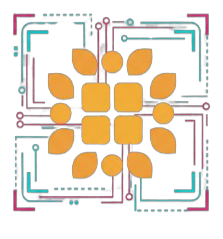

# 🎭 Museo Cultural Rumiñahui - Experiencia AR

<div align="center">
  
  
  **Aplicación web de Realidad Aumentada para el Museo y Centro Cultural Rumiñahui**
  
  [](https://reactjs.org/)
  [](https://firebase.google.com/)
  [](https://modelviewer.dev/)
  [](LICENSE)
</div>

---

## 📋 Descripción

Aplicación web progresiva (PWA) que permite a los visitantes del Museo y Centro Cultural Rumiñahui interactuar con avatares históricos y culturales ecuatorianos mediante Realidad Aumentada. Los usuarios pueden visualizar personajes 3D en su espacio real, capturar fotografías y compartirlas en una galería en la nube.

### ✨ Características Principales

- 🎨 **7 Avatares Culturales**: Personajes históricos y tradicionales ecuatorianos en 3D
- 📱 **Realidad Aumentada**: Visualiza avatares en tu espacio real usando AR
- 📸 **Captura y Galería**: Toma fotos con avatares y guárdalas en la nube
- 🔐 **Panel de Administración**: Sistema de autenticación para gestión de contenido
- 💧 **Marca de Agua Automática**: Logo institucional en todas las fotos
- 🎨 **Diseño Responsive**: Optimizado para móviles y escritorio
- ⚡ **PWA**: Instalable como aplicación nativa

---

## 🎭 Avatares Disponibles

1. **Chagra** - Personaje tradicional de la sierra ecuatoriana
2. **Choclito** - Representación de la agricultura y el maíz
3. **Juan Zangolqui** - Personaje histórico ecuatoriano
4. **Pingullero** - Músico tradicional ecuatoriano
5. **Rosa Montufar** - Personaje histórico ecuatoriano
6. **Ruco** - Sabio ancestral ecuatoriano
7. **Simón Bolívar** - El Libertador de América

---

## 🛠️ Tecnologías

### Frontend
- **React 18** - Biblioteca de interfaz de usuario
- **Model Viewer** - Renderizado 3D y soporte AR
- **CSS3** - Estilos personalizados con gradientes y animaciones

### Backend & Cloud
- **Firebase Firestore** - Base de datos en tiempo real
- **Firebase Storage** - Almacenamiento de imágenes
- **Firebase Hosting** - Despliegue de la aplicación

### Herramientas
- **Create React App** - Configuración inicial del proyecto
- **Canvas API** - Procesamiento de imágenes y marca de agua
- **GLB Format** - Modelos 3D optimizados

---

## 🚀 Instalación y Configuración

### Prerrequisitos
```bash
node >= 14.x
npm >= 6.x
```

### 1. Clonar el repositorio
```bash
git clone https://github.com/tu-usuario/museo-cultural-ar.git
cd museo-cultural-ar
```

### 2. Instalar dependencias
```bash
npm install
```

### 3. Configurar Firebase

1. Crea un proyecto en [Firebase Console](https://console.firebase.google.com/)
2. Habilita Firestore Database y Storage
3. Copia las credenciales de configuración
4. Actualiza `src/firebase-config.js`:
```javascript
const firebaseConfig = {
  apiKey: "TU_API_KEY",
  authDomain: "TU_AUTH_DOMAIN",
  projectId: "TU_PROJECT_ID",
  storageBucket: "TU_STORAGE_BUCKET",
  messagingSenderId: "TU_MESSAGING_SENDER_ID",
  appId: "TU_APP_ID",
  measurementId: "TU_MEASUREMENT_ID"
};
```

### 4. Agregar modelos 3D

Coloca los archivos GLB y PNG de los avatares en la carpeta `public/`:
```
public/
├── Chagra.glb
├── Chagra.png
├── Choclito.glb
├── Choclito.png
├── JuanZangolqui.glb
├── JuanZangolqui.png
├── Pingullero.glb
├── Pingullero.png
├── RosaMontufar.glb
├── RosaMontufar.png
├── Ruco.glb
├── Ruco.png
├── SimonBolivar.glb
├── SimonBolivar.png
├── logo.png
└── UniversitarioRU_Azul.png
```

### 5. Ejecutar en desarrollo
```bash
npm start
```

La aplicación se abrirá en `http://localhost:3000`

### 6. Construir para producción
```bash
npm run build
```

---

## 📱 Uso de la Aplicación

### Para Usuarios

1. **Seleccionar Avatar**: Elige uno de los 7 personajes disponibles
2. **Ver en AR**: Toca el botón "Ver en AR" (solo en dispositivos móviles)
3. **Capturar Foto**: Toma una foto en AR con tu cámara
4. **Subir Foto**: Selecciona la foto desde tu galería y súbela
5. **Ver Galería**: Explora todas las fotos compartidas

### Para Administradores

1. Accede a la **Galería de Fotos**
2. Presiona el botón **🔐 Admin**
3. Ingresa la contraseña: `museo2026`
4. Ahora puedes **eliminar fotos** con el botón 🗑️

> ⚠️ **Cambiar contraseña**: Edita `ADMIN_PASSWORD` en `src/components/AdminLogin.jsx`

---

## 🎨 Paleta de Colores
```css
/* Colores principales */
--primary-purple: #2d1b69
--primary-dark: #1a0b3d
--accent-orange: #ffa500
--accent-cyan: #00d9ff
--accent-pink: #ff6b9d

/* Gradientes */
background: linear-gradient(135deg, #2d1b69 0%, #1a0b3d 100%);
buttons: linear-gradient(135deg, #ff6b9d 0%, #ffa500 100%);
```

---

## 📂 Estructura del Proyecto
```
museo-cultural-ar/
├── public/
│   ├── index.html
│   ├── logo.png
│   ├── UniversitarioRU_Azul.png
│   └── [avatares .glb y .png]
├── src/
│   ├── components/
│   │   ├── AdminLogin.jsx
│   │   ├── AdminLogin.css
│   │   ├── ArExperience.jsx
│   │   ├── ArExperience.css
│   │   ├── AvatarMenu.jsx
│   │   ├── AvatarMenu.css
│   │   ├── Gallery.jsx
│   │   └── Gallery.css
│   ├── App.jsx
│   ├── App.css
│   ├── firebase-config.js
│   └── index.js
├── package.json
└── README.md
```

---

## 🔧 Configuración Avanzada

### Cambiar región de Firebase

En `firebase-config.js`, la región por defecto es `southamerica-east1` (São Paulo). Para mejor rendimiento desde Ecuador, esta es la configuración óptima.

### Ajustar tamaño de marca de agua

En `ArExperience.jsx`, línea ~55:
```javascript
// Cambiar 0.18 para ajustar el tamaño (0.10 - 0.25 recomendado)
const logoWidth = img.width * 0.18;
```

### Modificar avatares

Para agregar o cambiar avatares, edita `src/App.jsx`:
```javascript
const avatars = [
  {
    id: 'nuevo-avatar',
    name: 'Nombre del Avatar',
    model: '/NuevoAvatar.glb',
    thumbnail: '/NuevoAvatar.png',
    description: 'Descripción del personaje'
  },
  // ... más avatares
];
```

---

## 🌐 Despliegue

### Vercel (Recomendado)
```bash
npm install -g vercel
vercel login
vercel
```

### Firebase Hosting
```bash
npm install -g firebase-tools
firebase login
firebase init hosting
npm run build
firebase deploy
```

### Netlify

1. Conecta tu repositorio de GitHub
2. Build command: `npm run build`
3. Publish directory: `build`

---

## 🐛 Solución de Problemas

### AR no funciona en móvil
- Asegúrate de usar HTTPS (requerido para AR)
- Verifica que el dispositivo tenga soporte para ARCore (Android) o ARKit (iOS)

### Las fotos no se suben
- Verifica la configuración de Firebase Storage
- Revisa las reglas de seguridad en Firebase Console

### Modelos 3D no cargan
- Verifica que los archivos .glb estén en la carpeta `public/`
- Confirma que las rutas en `App.jsx` sean correctas
- Comprueba el tamaño de los archivos (< 10MB recomendado)

---

## 📊 Características Técnicas

- **Responsive Design**: Ancho máximo 600px para móviles
- **Compresión de Imágenes**: JPEG al 95% de calidad
- **Marca de Agua**: Canvas API con composición de imágenes
- **Almacenamiento**: Firebase Storage con URLs públicas
- **Base de Datos**: Firestore con timestamps automáticos
- **Autenticación**: Sistema de contraseña para administradores

---

## 🤝 Contribuciones

Las contribuciones son bienvenidas. Por favor:

1. Haz fork del proyecto
2. Crea una rama para tu feature (`git checkout -b feature/AmazingFeature`)
3. Commit tus cambios (`git commit -m 'Add some AmazingFeature'`)
4. Push a la rama (`git push origin feature/AmazingFeature`)
5. Abre un Pull Request

---

## 📄 Licencia

Este proyecto está bajo la Licencia MIT. Ver el archivo `LICENSE` para más detalles.

---

## 👥 Autor

**David Minango** - *Desarrollo Principal* - [Tu GitHub](https://github.com/pdavicho)

**Universitario Rumiñahui** 

---

## 🙏 Agradecimientos

- Google Model Viewer por la funcionalidad AR
- Firebase por la infraestructura en la nube
- Comunidad de React por las herramientas
- Museo Cultural Rumiñahui por la visión del proyecto

---

## 📞 Contacto

**Proyecto**: Museo Cultural Rumiñahui - AR Experience

**Sitio Web**: [museo-cultural.vercel.app](https://tu-url.vercel.app)

**Email**: pablodavid218@gmail.com

---

<div align="center">
  
### ⭐ Si te gusta este proyecto, dale una estrella en GitHub ⭐

Hecho con ❤️ para preservar la cultura ecuatoriana

</div>